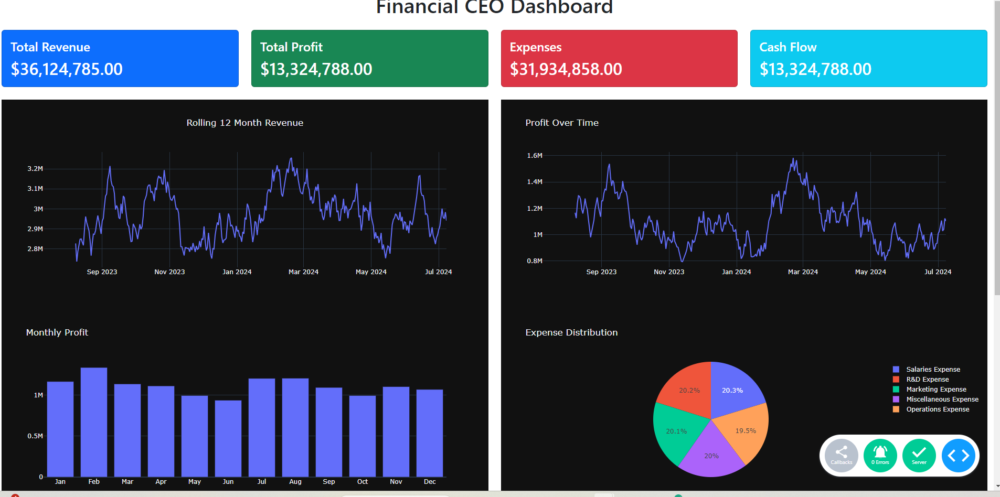

# FinancialCeo
A Financial CEO dashboard template made in Ploty Dash Python

## Related Blog Post

### Making a Financial CEO Dashboard with Python

For a step-by-step guide on how to create a comprehensive financial CEO dashboard using Python, check out this detailed [blog post on Codearmo](https://www.codearmo.com/python-tutorial/making-financial-ceo-dashboard-python).

This tutorial covers:

- Setting up the environment
- Importing necessary libraries
- Data preprocessing
- Creating visualizations
- Integrating everything into a dashboard

Click [here](https://www.codearmo.com/python-tutorial/making-financial-ceo-dashboard-python) to read more.
